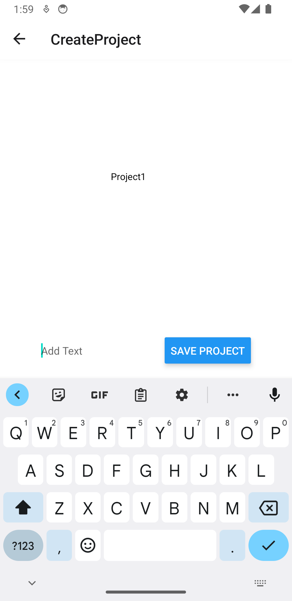
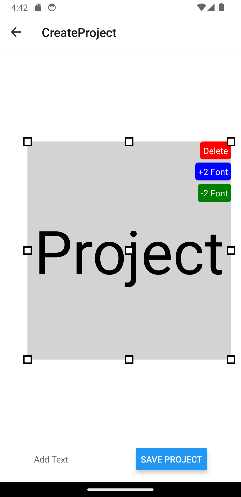

# Canvas_Editor

# Project Structure

The project structure is organized as follows:

- `App.js`: The main entry point for the application, defining navigation routes.
- `src/CreateProject.js`: The screen where users can create and edit projects, including adding and saving text blocks.
- `src/MyProject.js`: The screen that displays a list of saved projects, allowing users to view and delete them.
- `src/HomeScreen.js`: The home screen of the application, providing navigation options to create new projects or view existing ones.
- `src/DraggableText.js`: A component for creating draggable and resizable text blocks within the canvas.
- `assets/`: Directory for storing project assets such as background images.

# Third-party Libraries Used

- `React Navigation`: React Navigation is a popular library for handling navigation in React Native applications. It provides a flexible and customizable navigation solution with support for various navigation patterns, such as stack navigation, tab navigation, and drawer navigation
- `@react-native-async-storage/async-storage`: This library is used for asynchronous storage in React Native applications. It allows you to store and retrieve data on the device's local storage. In your project, you've used it to store and manage project texts locally.
- `react-native-gesture-handler`: React Native Gesture Handler is a library that provides native-driven gesture management for React Native applications. It's commonly used for handling touch gestures and interactions, making it easier to create interactive and responsive UI components.
- `@skynetcmg47/react-native-drag-resize`: This library adds drag-and-resize functionality to components in your React Native application. It enables users to interact with text blocks by dragging and resizing them within a canvas, which is a crucial feature for your project.

# Screenshots

### HOME PAGE

### CREATE PROJECT PAGE

### MY PROJECT PAGE

### KEYBOARD IN CREATE PROJECT

### ADD TEXT

### RESIZE TEXT

