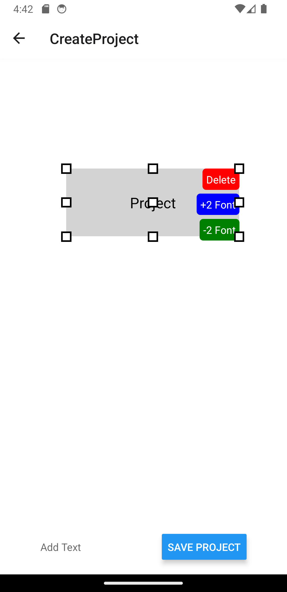

# Canvas_Editor

# Project Structure

The project structure is organized as follows:

- `App.js`: The main entry point for the application, defining navigation routes.
- `src/CreateProject.js`: The screen where users can create and edit projects, including adding and saving text blocks.
- `src/MyProject.js`: The screen that displays a list of saved projects, allowing users to view and delete them.
- `src/HomeScreen.js`: The home screen of the application, providing navigation options to create new projects or view existing ones.
- `src/DraggableText.js`: A component for creating draggable and resizable text blocks within the canvas.
- `assets/`: Directory for storing project assets such as background images.

# Third-party Libraries Used

- `React Navigation`: React Navigation is a popular library for handling navigation in React Native applications. It provides a flexible and customizable navigation solution with support for various navigation patterns, such as stack navigation, tab navigation, and drawer navigation
- `@react-native-async-storage/async-storage`: This library is used for asynchronous storage in React Native applications. It allows you to store and retrieve data on the device's local storage. In your project, you've used it to store and manage project texts locally.
- `react-native-gesture-handler`: React Native Gesture Handler is a library that provides native-driven gesture management for React Native applications. It's commonly used for handling touch gestures and interactions, making it easier to create interactive and responsive UI components.
- `@skynetcmg47/react-native-drag-resize`: This library adds drag-and-resize functionality to components in your React Native application. It enables users to interact with text blocks by dragging and resizing them within a canvas, which is a crucial feature for your project.

# Approach

The approach to developing the React Native project described in the provided code involves several key steps and components. Below is an overview of the approach:

1. **Setting Up the Project Structure**:

   - The project structure is organized into separate components and screens, following best practices for React Native development.
   - The main app component, `App.js`, is configured with a navigation system using React Navigation. It defines the primary navigation stack, including screens for the home screen, creating a project, and managing projects.

2. **Home Screen (`HomeScreen.js`)**:

   - The home screen is the entry point of the application. It displays a welcome message and options to either create a new project or view existing projects.
   - The background image provides a visually appealing interface, with a semi-transparent overlay to enhance readability.
   - If CreateProject is clicked, CreateProject will be navigated with `project_id=-1`, later `project_id` will be set to `database.length` (i,e, new project)

3. **Create Project Screen (`CreateProject.js`)**:

   - This screen allows users to create and edit projects, which consist of draggable and resizable text blocks.
   - Users can add text blocks by entering text in the input field and tapping the "Add Text" button.
   - Database stores `list(list(objects))`. Object contains `{text, x, y, w, h, project_id}` to restore saved project with correct text, coordinate and size.
   - The draggable and resizable text blocks are managed using the `@skynetcmg47/react-native-drag-resize` library, enhancing user interaction.
   - Users can save their projects, and the data is stored locally using `AsyncStorage`. Projects can be either newly created or edited.
   - Parameter `project_id` will be used to load existing project. Else if `project_id=-1`, then new project will be created with `project_id=database.length`

4. **My Projects Screen (`MyProject.js`)**:
   - This screen displays a list of saved projects, allowing users to view and manage their existing projects.
   - Projects are retrieved from local storage using `AsyncStorage` and displayed in a list format.
   - Each project item shows the project's title (the text from the first text block) and provides options to view and delete the project.
   - After cliking view, CreateProject will navigated with appropiate `project_id`

# Screenshots

### HOME PAGE

### CREATE PROJECT PAGE

### MY PROJECT PAGE

### KEYBOARD IN CREATE PROJECT

### ADD TEXT

### RESIZE TEXT

